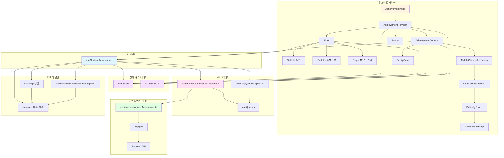
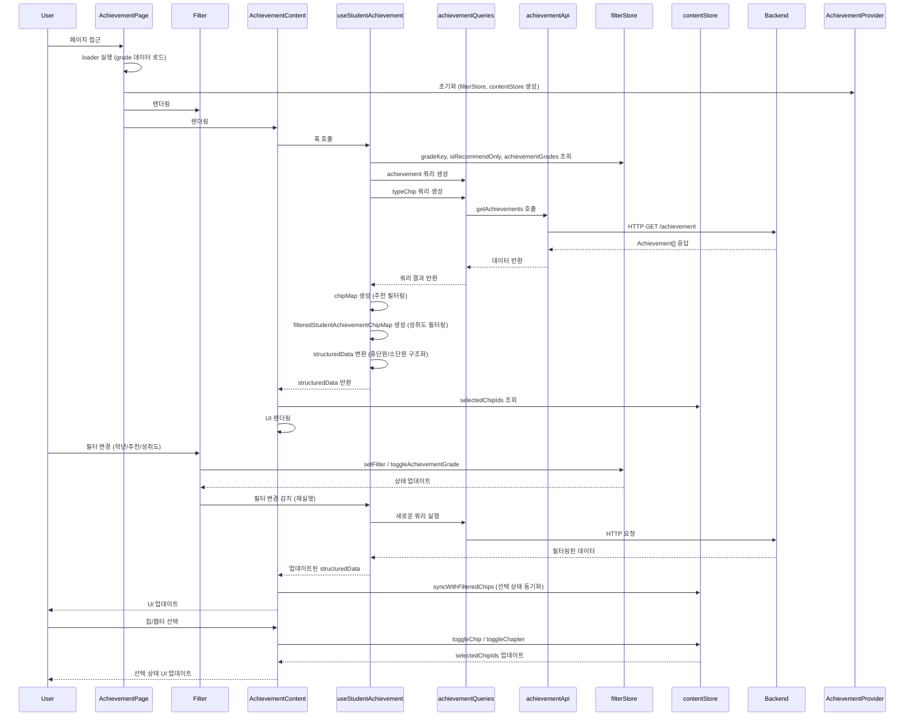

# Concept

유형 성취도 분석

## 🚀 기술 스택

- **프레임워크**: React 19.2.0
- **빌드 도구**: Vite 7.2.4
- **언어**: TypeScript 5.9.3
- **스타일링**: Emotion
- **상태 관리**: Zustand
- **데이터 페칭**: TanStack Query (React Query)
- **라우팅**: React Router 7
- **UI 컴포넌트**: Radix UI
- **HTTP 클라이언트**: Axios
- **패키지 매니저**: pnpm

## 📁 프로젝트 구조

이 프로젝트는 Feature-Sliced Design 아키텍처를 따릅니다.

```text
src/
├── app/              # 애플리케이션 초기화 및 라우팅
├── entities/         # 비즈니스 엔티티 (achievement, grade, student, typeChip)
├── pages/            # 페이지 컴포넌트
│   └── Achievement/  # 성취도 페이지
├── shared/           # 공유 모듈 (UI, 스타일, 유틸리티)
└── widgets/          # 복합 UI 컴포넌트
```

### 아키텍처 다이어그램

#### Achievement 페이지 구조 (서비스, 쿼리, 컴포넌트 중심)



#### Achievement 페이지 데이터 흐름



## 🛠️ 설치 및 실행

### 필수 요구사항

- Node.js (권장: 18.x 이상)
- pnpm

### 설치

```bash
pnpm install
```

### 개발 서버 실행

```bash
pnpm dev
```

개발 서버는 `http://localhost:5000`에서 실행됩니다.

### 빌드

```bash
pnpm build
```

### 빌드 미리보기

```bash
pnpm preview
```

### 린트

```bash
pnpm lint
```

### 코드 포맷팅

```bash
pnpm format
```

## 📦 주요 기능

- **학생 유형 성취도 조회**: 학생별 성취도 데이터를 조회하고 표시
- **필터링**: 학년, 난이도, 챕터 등 다양한 조건으로 필터링
- **트리 구조 표시**: 중간 챕터와 소단원을 아코디언 형태로 표시
- **체크박스 트리**: 계층적 구조의 체크박스 트리 UI

## 🎨 스타일링

- Emotion을 사용한 CSS-in-JS 스타일링
- Pretendard 폰트 사용
- 반응형 디자인 지원

## 🔧 환경 설정

프로젝트는 다음 경로 별칭을 사용합니다:

- `@/` → `src/`

## 기타 프로젝트를 진행하며 느낀점

### API 응답 관련

- API 응답에서 중단원이 여러개였으면 좋겠습니다
- API 응답에서 `conceptChipId`와 `conceptId`의 차이에 대한 명확한 설명이 필요합니다
- 노션 문서의 API 응답 예시가 업데이트되면 좋겠습니다

### 디자인 관련

- 피그마에서 성취도 칩을 선택했을 때, 추천유형만 보기 했을 때, 한 컬럼이 없을 때 등 예시 디자인 케이스가 있으면 좋겠습니다
- 피그마에서 디자인 파일 수치가 잘 안 잡힙니다

### 문서 관련

- 노션 문서에서 구현 요구사항에서 필터 구현 내용 설명이 유형칩 리스트보다 순서가 더 먼저였으면 좋겠습니다

### 임의로 구현한 부분

- **아코디언**: 멀티인지 싱글인지 명시가 없어서 멀티 & 디폴트 열림으로 임의 구현했습니다
- **체크박스, 드롭다운**: 디자인이 없어서 임의로 구현했습니다
